# Network and Computer Security: DeathNode

### `Grade: 19.0/20`

<div align="center">

**An anonymous, secure distributed reporting platform with end-to-end encryption and advanced consistency guarantees**

[Demo Video](https://drive.google.com/file/d/1brFnYBAC51IwPCIoNh3Bd1s2n_srq8wr/view?usp=sharing) • [Project Specification](resources/docs/Project-Specification.md) • [Detailed Report](resources/docs/REPORT.md)

</div>

---

## Table of Contents

- [Overview](#-overview)
- [Key Features](#-key-features)
- [Project Structure](#-project-structure)
- [Architecture](#-architecture)
- [Getting Started](#-getting-started)
- [Security Mechanisms](#-security-mechanisms)
- [Technologies](#-technologies)
- [Resources](#-resources)
- [Authors](#-authors)

---

## Overview

**DeathNode** is a secure, distributed anonymous reporting platform developed as part of the Network and Computer Security (SIRS) course at Instituto Superior Técnico. The system enables participants of a clandestine group to submit encrypted reports about alleged crimes or suspects before information reaches authorities, while maintaining full anonymity and ensuring data integrity.

This project addresses the **DeathNode scenario** from the [SIRS Project Scenarios](resources/docs/Project-Scenarios.md), implementing **Challenge B**: a vigilant server monitoring system to detect and prevent flooding attacks while maintaining system availability.

### Design

DeathNode operates as a **centralized synchronization model** where client nodes exchange reports through a central server. The server is intentionally **untrusted** with report contents - all reports are encrypted end-to-end and remain confidential to authorized nodes only. The system prioritizes:

- **Strong cryptographic guarantees** over user convenience
- **Consistency and integrity** over availability (fail-secure approach)
- **Defense-in-depth** through multiple independent security layers

---

## Key Features

### Core Security Guarantees

- **SR1 - Confidentiality**: End-to-end encryption using AES-256-GCM ensures only authorized network participants can decrypt reports
- **SR2 - Individual Integrity**: Tamper-evident reports with Ed25519 digital signatures prevent unauthorized modifications
- **SR3 - Batch Integrity**: Per-sender hash chains and Merkle tree commitments detect missing, duplicated, or out-of-order reports
- **SR4 - Consistency**: Cryptographic block chaining and signed commitments prevent forged or diverging histories

### Advanced Security Features

- **Mutual TLS (mTLS)** authentication for all network communications
- **Two-level key architecture** separating transport and application-layer security
- **Multi-stage verification pipeline** for synchronization integrity
- **Flooding attack detection** with dynamic temporary banning via vigilant monitor
- **At-rest data integrity** verification with on-demand tamper detection

### System Capabilities

- Pseudonymous report submission with no user authentication
- Distributed report storage with periodic synchronization
- Network segmentation with strict firewall policies
- Real-time intrusion detection and traffic monitoring
- Comprehensive audit trails and cryptographic proof chains

---

## Project Structure

```
death-node/
├── deathnode-network/          # Main project directory
│   ├── deathnode-client/       # Client node implementation
│   │   ├── src/main/java/      # Client-side application logic
│   │   ├── client-data/        # Local encrypted report storage
│   │   ├── boot-config*.sh     # Network configuration scripts
│   │   └── pom.xml
│   ├── deathnode-server/       # Central synchronization server
│   │   ├── src/main/java/      # Server-side gRPC services
│   │   ├── server-data/        # TLS certificates and keys
│   │   └── pom.xml
│   ├── deathnode-common/       # Shared protocol definitions
│   │   ├── src/main/proto/     # Protocol Buffer schemas
│   │   └── src/main/java/      # Common models and utilities
│   ├── deathnode-database/     # PostgreSQL database setup
│   │   ├── server_schema.sql   # Database initialization
│   │   ├── setup-db.sh         # Docker container script
│   │   └── boot-config.sh
│   ├── deathnode-monitor/      # Vigilant IDS/router
│   │   ├── monitor.py          # Traffic analysis (Python/Scapy)
│   │   └── boot-config.sh
│   ├── deathnode-tool/         # Secure document library & CLI
│   │   ├── src/main/java/      # Cryptographic operations
│   │   └── README.md           # Tool documentation
│   ├── generate-all-keys.sh    # PKI and key generation script
│   └── pom.xml                 # Parent Maven configuration
├── resources/
│   ├── docs/                   # Project documentation
│   │   ├── REPORT.md           # Comprehensive technical report
│   │   ├── Project-Specification.md
│   │   ├── Project-Scenarios.md
│   │   └── DEMO.url            # Video demonstration link
│   └── img/                    # Diagrams and screenshots
└── README.md
```

### Key Components

- **`deathnode-client/`**: Client nodes that create, encrypt, and synchronize reports
- **`deathnode-server/`**: Central server coordinating synchronization rounds
- **`deathnode-common/`**: Shared Protocol Buffer definitions and domain models
- **`deathnode-database/`**: PostgreSQL container for persistent metadata storage
- **`deathnode-monitor/`**: Vigilant gateway detecting flooding attacks
- **`deathnode-tool/`**: Cryptographic library implementing secure document format

---

## Architecture

### Network Topology

The system consists of **5 virtual machines** across **3 isolated networks**:


| Machine | Network(s) | Role | IP Address |
|---------|-----------|------|------------|
| **Server** | sw0 | Central synchronization coordinator | 192.168.0.100 |
| **Database** | sw0 | PostgreSQL data persistence | 192.168.0.200 |
| **Monitor** | sw0, sw1, sw2 | IDS/Gateway with NAT forwarding | 192.168.0.1 (sw0)<br>192.168.1.1 (sw1)<br>192.168.2.1 (sw2) |
| **NodeA** | sw1 | Client node (AlphaNode) | 192.168.1.101 |
| **NodeB** | sw2 | Client node (BetaNode) | 192.168.2.101 |

### Communication Channels

1. **Client ↔ Server**: Bidirectional gRPC streaming over TLS 1.3 with mutual authentication
2. **Server ↔ Database**: JDBC over TLS with client certificate authentication (CN=`dn_admin`)
3. **Monitor**: Transparent NAT gateway with iptables-based firewall and intrusion detection

### Security Architecture

```
┌─────────────────────────────────────────────────────────┐
│ Application Layer (User-Level Crypto)                  │
│ • AES-256-GCM encryption (report confidentiality)      │
│ • Ed25519 signatures (integrity & authenticity)        │
│ • Hash chains (per-sender ordering)                    │
│ • Merkle trees (batch commitments)                     │
└─────────────────────────────────────────────────────────┘
                          ↓
┌─────────────────────────────────────────────────────────┐
│ Transport Layer (TLS 1.3 mTLS)                         │
│ • RSA-2048 server/client certificates                  │
│ • X.509 PKI with self-signed CA                        │
│ • Perfect Forward Secrecy (PFS)                        │
└─────────────────────────────────────────────────────────┘
                          ↓
┌─────────────────────────────────────────────────────────┐
│ Network Layer (Firewall & Segmentation)                │
│ • iptables strict ingress/egress rules                 │
│ • Network isolation (sw0/sw1/sw2)                      │
│ • Monitor-enforced traffic control                     │
└─────────────────────────────────────────────────────────┘
```

For detailed architectural decisions and threat model analysis, see the [Technical Report](resources/docs/REPORT.md).

---

## Getting Started

### Prerequisites

**Base Requirements:**
- Linux Debian 64-bit (Kali Linux recommended)
- Virtualization platform: VirtualBox or VMware
- Minimum 5 VMs (or 1 base VM to clone)

**Software Stack:**
- Java 21+
- Maven 3.9+
- Docker 20.10+
- Python 3.11+ (with Scapy)
- PostgreSQL 18.0
- iptables

### Installation

#### 1. Download and Configure Base VM

Download the official Kali Linux distribution:
- **VirtualBox**: [Download](https://cdimage.kali.org/kali-2025.4/kali-linux-2025.4-virtualbox-amd64.7z) | [Instructions](https://www.kali.org/docs/virtualization/import-premade-virtualbox/)
- **VMware**: [Download](https://cdimage.kali.org/kali-2025.4/kali-linux-2025.4-vmware-amd64.7z) | [Instructions](https://www.kali.org/docs/virtualization/import-premade-vmware/)

Update the system:
```sh
sudo apt update && sudo apt upgrade -y
```

Install base packages:
```sh
sudo apt install -y ca-certificates curl gnupg lsb-release git
```

#### 2. Clone the Project

```sh
git clone https://github.com/tecnico-sec/A53-DeathNode.git
cd A53-DeathNode/deathnode-network
```

#### 3. Install Dependencies

Run the automated installation script:
```sh
chmod +x requirements.sh
./requirements.sh
```

Verify installations:
```sh
java -version    # Expected: openjdk 21+
mvn -version     # Expected: Apache Maven 3.9+
docker --version # Expected: Docker 20.10+
python3 --version # Expected: Python 3.11+
```

#### 4. Build the Project

```sh
mvn clean install
```

#### 5. Clone VMs

Power off the base VM and clone it 4 times following [these instructions](https://github.com/tecnico-sec/Virtual-Networking?tab=readme-ov-file#21-clone-virtual-machines):
- **Server**
- **Database**
- **Monitor**
- **NodeA**
- **NodeB**

#### 6. Configure Network Adapters

For each VM, configure network adapters as shown:

| VM | Adapter 1 | Adapter 2 | Adapter 3 |
|----|-----------|-----------|-----------|
| Server | sw0 | - | - |
| Database | sw0 | - | - |
| Monitor | sw0 | sw1 | sw2 |
| NodeA | sw1 | - | - |
| NodeB | sw2 | - | - |

Follow [VirtualBox network configuration instructions](https://github.com/tecnico-sec/Virtual-Networking?tab=readme-ov-file#22a-virtualbox).

---

### Machine Configuration

Each machine requires specific configuration via boot scripts. Execute commands **in order**:

#### Machine 1: Database Server

```sh
cd deathnode-database
sudo ./boot-config.sh
sudo ./setup-db.sh
```

**Verify:** `sudo docker ps` should show `postgres:18` running.

---

#### Machine 2: Application Server

```sh
cd deathnode-server
sudo ./boot-config.sh
```

Initialize database schema:
```sh
psql -h 192.168.0.200 -U dn_admin -d deathnode -f ../deathnode-database/server_schema.sql
# Password: dn_pass
```

Start server:
```sh
mvn spring-boot:run
```

**Verify:** Server starts without errors and connects to database.

---

#### Machine 3: Monitor (IDS/Gateway)

```sh
cd deathnode-monitor
sudo ./boot-config.sh
python3 monitor.py
```

**Verify:** Monitor displays packet capture interface.

---

#### Machine 4 & 5: Client Nodes

**NodeA:**
```sh
cd deathnode-client
sudo ./boot-config1.sh
java -jar target/deathnode-client-1.0.0.jar "nodeA" "AlphaNode"
```

**NodeB:**
```sh
cd deathnode-client
sudo ./boot-config2.sh
java -jar target/deathnode-client-1.0.0.jar "nodeB" "BetaNode"
```

**Verify:** Nodes connect to server through monitor without errors.

---

## Demonstration

With all networks and virtual machines properly configured and operational, this section provides a comprehensive walkthrough of the DeathNode system's core capabilities and security features. The demonstration showcases the complete lifecycle of report creation, synchronization, and integrity verification, while highlighting the system's defense mechanisms against common attacks.

**Note**: All commands shown are executed from client node terminals. Screenshots display corresponding outputs from the server, client nodes, and the vigilant monitor to illustrate the end-to-end flow of operations.

### 1. Node Initialization and Connection Establishment

The client node application provides an interactive command-line interface for all operations. To launch a node:

```sh
cd deathnode-client/
java -jar target/deathnode-client-1.0.0.jar "nodeA" "AlphaNode"
```

**What happens during startup:**
- The node establishes a secure mTLS connection to the server through the monitor gateway
- TLS handshake with mutual certificate authentication (client and server verify each other)
- Initial synchronization request to retrieve the latest global state
- Node enters ready state, awaiting user commands

<p align="center">
  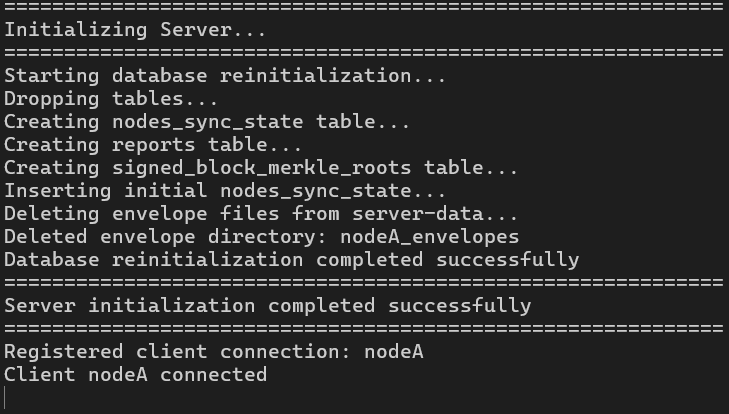
  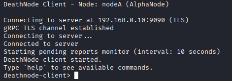
</p>
<p align="center">
     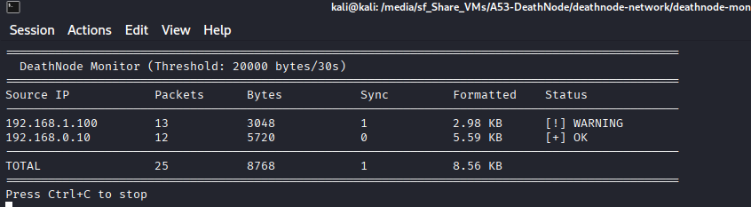
</p>
<p align="center">
  <em>Server successfully accepts the incoming mTLS connection from NodeA (left) • NodeA establishes connection and enters interactive mode (right)<br>
Monitor captures and forwards the initial sync request, demonstrating its transparent gateway role (bottom)</em>
</p>

---

### 2. Creating and Synchronizing Reports

#### Step 2.1: Report Creation

The `create-report` command enables nodes to submit new reports to the network. The command prompts for three required fields:

1. **Suspect**: Identifier of the individual or entity being reported
2. **Description**: Details of the alleged crime or suspicious activity
3. **Location**: Geographic location associated with the report

Upon submission, the system performs the following operations:
- Generates a unique `report_id` and assigns a per-sender `node_sequence_number`
- Computes `prev_envelope_hash` linking to the previous report (hash chain)
- Encrypts the report using a fresh AES-256 DEK, wrapped for all authorized recipients
- Signs the envelope with the node's Ed25519 private key
- Stores the encrypted envelope locally and adds it to the unsynced buffer

<p align="center">
  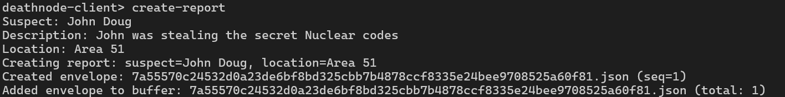
</p>
<p align="center">
  <em>Interactive report creation showing user input and successful envelope generation with assigned sequence number</em>
</p>

#### Step 2.2: Automatic Synchronization Trigger

When the local buffer reaches a predefined threshold (default: 3 reports), the node automatically initiates a synchronization round:

1. **Client computes Merkle root** over buffered envelopes and signs it
2. **Sync request** sent to server (via monitor) with signed commitment
3. **Server collects buffers** from all active nodes
4. **Server verification**:
   - Validates node signatures on Merkle roots
   - Recomputes roots to verify buffer integrity
   - Checks hash chain continuity per sender
5. **Global ordering** by metadata timestamp
6. **Block creation** with cryptographic commitment to the ordering
7. **Broadcast** of `SyncResult` containing ordered envelopes and block proof
8. **Client verification** through 6-stage pipeline (block signature, chain continuity, Merkle root, buffer signatures, hash chains, individual envelope decryption)

<p align="center">
  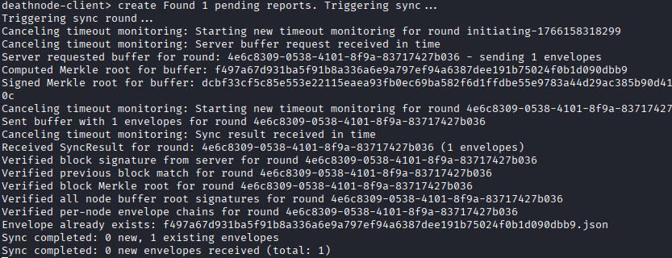
  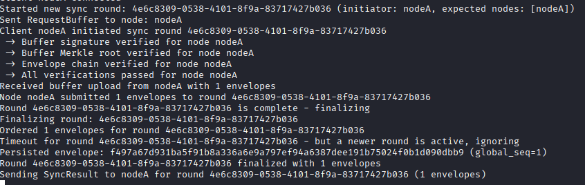
</p>
<p align="center">
     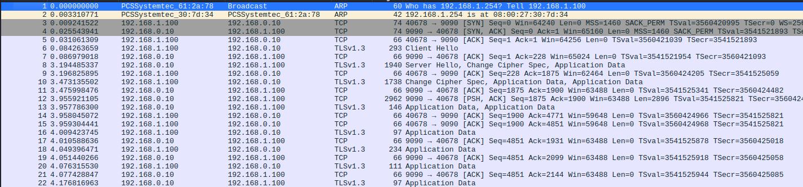
</p>
<p align="center">
  <em>NodeA initiates sync and receives the globally ordered reports from the server (left) • Server processes the sync round, verifies all commitments, and broadcasts the result (right)<br>
Wireshark capture confirms TLS 1.3 encryption—all application data is protected from eavesdropping (bottom)</em>
</p>

#### Step 2.3: Verification of Synchronization

The `list-reports` command displays all locally stored reports with their synchronization status. Key attributes to verify:

- **`local_seq`**: Per-node sequence number (monotonically increasing)
- **`global_seq`**: Position in the global total order (assigned by server)
- **`hash`**: Envelope cryptographic fingerprint (detects tampering)

If `global_seq` is present, the report has been successfully synchronized across all nodes in the network.

<p align="center">
  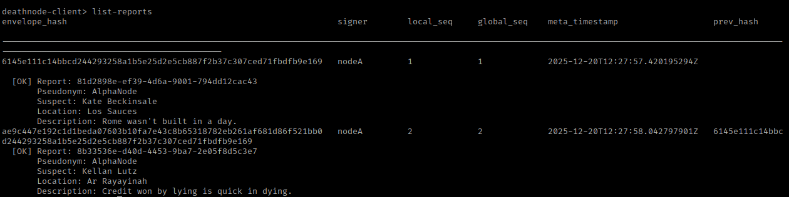
</p>

---

### 3. Flooding Attack Detection and Mitigation

#### Challenge B: Vigilant Monitor in Action

The `create-random` command simulates an abusive node attempting to flood the network with spam reports. This triggers the monitor's intrusion detection system (IDS):

**Attack simulation:**
```
> create-random
Number of reports: 100
```

**Monitor detection logic:**
- Tracks synchronization request frequency per node in a 30-second sliding window
- **First violation**: If a second sync request arrives within 30s of the first, the node is flagged
- **Immediate response**: Monitor adds an iptables rule to drop all packets from the offending IP
- **Exponential backoff**: Block duration doubles with each subsequent violation (30s → 60s → 120s → ...)
- **Automatic recovery**: Rules expire after timeout, allowing legitimate nodes to recover from transient issues

This design balances security (preventing DoS attacks) with availability (temporary blocks rather than permanent bans).

<p align="center">
   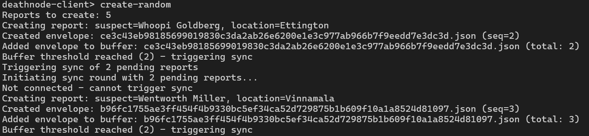
   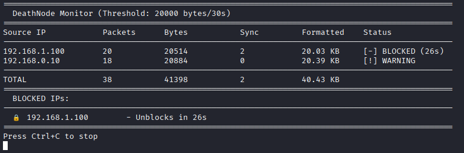
</p>
<p align="center">
<em>NodeA executes the flooding simulation, rapidly creating 100 reports and triggering multiple sync requests (left)<br>
Monitor detects the anomalous behavior and enforces a temporary network-level block via dynamic iptables rules (right)</em>
</p>

---

### 4. Security Guarantees in Action

#### 4.1 Data Integrity Verification (SR2)

DeathNode's cryptographic design ensures **tamper-evident** reports. Any modification to encrypted envelope files—whether malicious or accidental—is immediately detectable.

**Demonstration:**
1. Manually edit a byte in any field of an encrypted envelope (e.g., change `report_id` in metadata)
2. Attempt to decrypt and list reports using `list-reports`
3. **Result**: AES-GCM authentication fails or signature verification fails, depending on what was modified

**Why this works:**
- Metadata is bound to ciphertext as **Additional Authenticated Data (AAD)** in AES-GCM
- Ed25519 signature covers both plaintext and metadata
- Any change to either breaks cryptographic verification

<p align="center">
   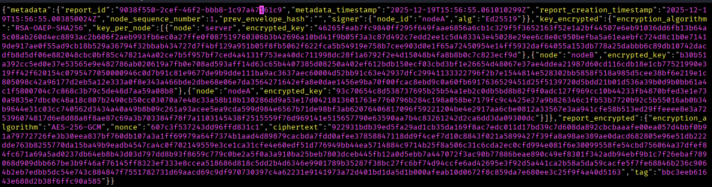
   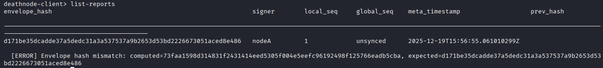
</p>
<p align="center">
<em>Original encrypted envelope before tampering (left) • Integrity check failure displayed when attempting to list the modified report—hash mismatch immediately detected (right)</em>
</p>

#### 4.2 Ordering and Consistency Verification (SR3, SR4)

The per-sender hash chain and global block chain together prevent:
- **Missing reports**: Hash chain breaks if a report is omitted
- **Duplicates**: Sequence numbers prevent replay attacks
- **Reordering**: Hash pointers enforce strict ordering
- **Equivocation**: Server cannot present different histories to different nodes (block commitments are signed)

**Demonstration of order tampering detection:**

If the server (or an attacker) attempts to reorder reports or present inconsistent histories, clients detect the violation during the 6-stage verification pipeline and reject the entire sync round.

<p align="center">
  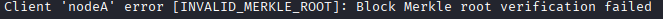
</p>
<p align="center">
  <em>Client detects and rejects a synchronization round where report ordering violates hash chain constraints</em>
</p>

---  

For a complete video walkthrough including additional scenarios and detailed explanations, see the [Demo Video](https://drive.google.com/file/d/1brFnYBAC51IwPCIoNh3Bd1s2n_srq8wr/view?usp=sharing).

---

## Security Mechanisms

### Secure Document Format

Each report envelope consists of three layers:

```json
{
  "metadata": {
    "report_id": "abc123",
    "node_sequence_number": 42,
    "prev_envelope_hash": "SHA256(previous_envelope)",
    "signer": {"node_id": "nodeA", "alg": "Ed25519"}
  },
  "key_encrypted": {
    "encryption_algorithm": "RSA-OAEP-SHA256",
    "key_per_node": [
      {"node": "nodeA", "encrypted_key": "b64(DEK_wrapped)"},
      {"node": "nodeB", "encrypted_key": "b64(DEK_wrapped)"}
    ]
  },
  "report_encrypted": {
    "encryption_algorithm": "AES-256-GCM",
    "nonce": "b64(12_bytes)",
    "ciphertext": "b64(...)",
    "tag": "b64(16_bytes)"
  }
}
```

**Inner Payload (encrypted):**
```json
{
  "report": {/* suspect, description, location */},
  "signature": "Ed25519(canonical(report) || canonical(metadata))"
}
```

### Synchronization Protocol

1. **Node generates reports** → stored encrypted locally with per-sender sequence numbers
2. **Buffer threshold reached** → compute Merkle root, sign commitment
3. **Sync request** → server requests buffers from all nodes
4. **Server verification**:
   - Verify node signatures on Merkle roots
   - Recompute Merkle roots from received envelopes
   - Validate hash chain continuity per sender
5. **Global ordering** → sort by metadata timestamp
6. **Block creation** → compute block Merkle root, sign, link to previous block
7. **Broadcast** → send `SyncResult` with ordered envelopes + block commitment
8. **Client verification** (6-stage pipeline):
   - Stage 1: Verify server block signature
   - Stage 2: Check block chain continuity
   - Stage 3: Recompute block Merkle root
   - Stage 4: Verify per-node buffer signatures
   - Stage 5: Validate per-sender hash chains
   - Stage 6: Decrypt and verify individual envelopes

Any verification failure triggers immediate rejection and error reporting.

### Cryptographic Primitives

| Operation | Algorithm | Parameters |
|-----------|-----------|------------|
| Symmetric encryption | AES-256-GCM | 12-byte nonce, 128-bit tag, metadata as AAD |
| Key wrapping | RSA-OAEP | SHA-256, MGF1, 2048-bit keys |
| Digital signatures | Ed25519 | No pre-hashing (internal) |
| Hash chains | SHA-256 | 256-bit output, hex-encoded |
| Merkle trees | SHA-256 | Binary tree, leaf=H(envelope), internal=H(left\|\|right) |
| TLS | TLS 1.3 | mTLS with RSA-2048 certificates |

For detailed security analysis and threat mitigation strategies, consult the [Technical Report](resources/docs/REPORT.md#5-project-development).

---

## Technologies

| Layer | Technology | Purpose |
|-------|-----------|---------|
| **Application** | Java 21 | Core application logic |
| | Spring Boot 3 | Server framework & dependency injection |
| | gRPC + Protobuf 3 | High-performance RPC with bidirectional streaming |
| | Gson | JSON processing for envelopes |
| **Storage** | PostgreSQL 18 | Server-side metadata persistence |
| | SQLite 3 | Client-side local database |
| | Filesystem | Encrypted envelope storage |
| **Security** | Java Cryptography Architecture (JCA) | AES-GCM, RSA-OAEP, Ed25519 |
| | OpenSSL | Certificate generation & TLS key management |
| | Java KeyStore (JKS) | Private key protection |
| **Network** | Docker | PostgreSQL containerization |
| | iptables | Firewall rules & NAT |
| | Python 3 + Scapy | Traffic monitoring & IDS |
| **Build** | Maven 3.9 | Multi-module project management |

---

## Resources

### Documentation

- [Technical Report](resources/docs/REPORT.md) - In-depth implementation analysis (7000+ words)
- [Project Specification](resources/docs/Project-Specification.md) - Official course requirements
- [Project Scenarios](resources/docs/Project-Scenarios.md) - DeathNode scenario description
- [Demo Video](https://drive.google.com/file/d/1brFnYBAC51IwPCIoNh3Bd1s2n_srq8wr/view?usp=sharing) - Full system demonstration

### External References

- [Java Security Overview](https://docs.oracle.com/en/java/javase/21/security/java-security-overview1.html)
- [gRPC Java Documentation](https://grpc.io/docs/languages/java/)
- [PostgreSQL SSL Documentation](https://www.postgresql.org/docs/18/ssl-tcp.html)
- [NIST AES-GCM Specification](https://nvlpubs.nist.gov/nistpubs/legacy/sp/nistspecialpublication800-38d.pdf)
- [Ed25519 Signature Scheme](https://ed25519.cr.yp.to/)

---

## Authors

| <div align="center"><a href="https://github.com/tomasf18"></a><br/><strong>Tomás Santos</strong><br/>116122<br/></div> | <div align="center"><a href="https://github.com/pedropmad"></a><br/><strong>Pedro Duarte</strong><br/>116390<br/></div> | <div align="center"></a><br/><strong>Guilherme Pais</strong><br/>116496<br/></div> |
| --- | --- | --- |

---

<div align="center">

**Instituto Superior Técnico** • **Network and Computer Security** • **2025/2026**

</div>
