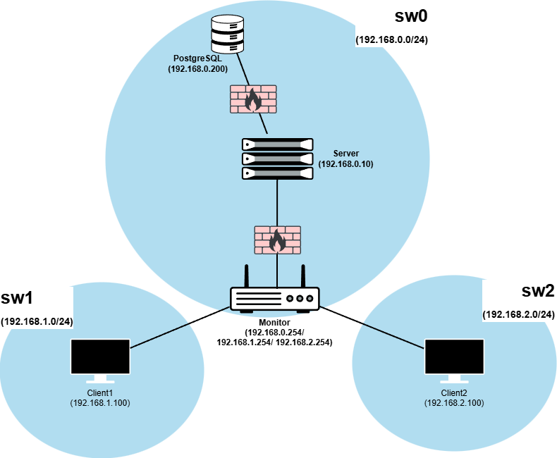

# A53 DeathNode

## Team

| Number | Name           | User                                      | E-mail                                          |
|--------|----------------|-------------------------------------------|-------------------------------------------------|
| 116496 | Guilherme Pais | <https://github.com/Guilherme-Parentesco> | <mailto:guilherme.p.pais@tecnico.ulisboa.pt>    |
| 116122 | Tomás Santos   | <https://github.com/tomasf18>             | <mailto:tomas.santos.f@tecnico.ulisboa.pt>      |
| 116390 | Pedro Duarte   | <https://github.com/pedropmad>            | <mailto:pedro.alegre.duarte@tecnico.ulisboa.pt> |

  


## Contents

This repository contains documentation and source code for the *Network and Computer Security (SIRS)* project scenario **DeathNode**.

The [REPORT](./docs/REPORT.md) document provides a detailed overview of the key technical decisions and various components of the implemented project.
It offers insights into the rationale behind these choices, the project's architecture, and the impact of these decisions on the overall functionality and performance of the system.

This document presents installation and demonstration instructions.

All virtual machines are based on Debian 64-bit Linux, and the software stack includes:
- **Java 17+** and **Maven 3.x** for building and running the server and client applications. 
- Docker for running the **PostgreSQL** database container. 
- **iptables** for configuring firewall rules and network forwarding between the server, clients, and monitor. 
- **Boot scripts** (`boot-config.sh`) for each machine, which configure static IP addresses, subnets, 
and firewall rules specific to each role (server, database, monitor).

## Installation

To see the project in action, it is necessary to setup a virtual environment, with 3 networks (sw0, sw1, sw2) and 5 machines:   
- Main server (sw0);
- Database (sw0);
- Monitor (sw0, sw1 and sw2);
- 2 clients (sw1 and sw2, one for each client).

The following diagram shows the networks and machines:



### Prerequisites

All the virtual machines are based on: Linux debian 64-bit 

**Download the official Kali Linux distribution:**
- **Virtual Box**: [Download](hhttps://cdimage.kali.org/kali-2025.4/kali-linux-2025.4-virtualbox-amd64.7z) and [Instructions](https://www.kali.org/docs/virtualization/import-premade-virtualbox/)
- **VMware**: [Download](https://cdimage.kali.org/kali-2025.4/kali-linux-2025.4-vmware-amd64.7z) and [Instructions](https://www.kali.org/docs/virtualization/import-premade-vmware/)

**After the base virtual machine is installed and running, update the system:**
```sh
sudo apt update && sudo apt upgrade -y
```

Install the required base packages:
```sh
sudo apt install -y \
  ca-certificates \
  curl \
  gnupg \
  lsb-release \
  git
```

Install Docker:
```sh
sudo apt install -y docker.io
sudo systemctl enable docker
sudo systemctl start docker

sudo docker pull postgres:18
```

Java & Maven Installation:
```sh
sudo apt install -y openjdk-17-jdk
sudo apt install -y maven
```

Verify installations:
```sh
java -version
mvn -version
docker --version
```

Also have the need to clone the project repositorie:
```sh
git clone https://github.com/tecnico-sec/A53-DeathNode.git
```

**Once the base virtual machine is fully configured:**
1. Power off the VM
2. Clone it, following this [instructions](https://github.com/tecnico-sec/Virtual-Networking?tab=readme-ov-file#21-clone-virtual-machines), to create the remaining machines:
   - **Server**
   - **Database**
   - **Monitor**
   - **Client1**
   - **Client2**
3. After the clone update each network configuration using this [instructions](https://github.com/tecnico-sec/Virtual-Networking?tab=readme-ov-file#22a-virtualbox), and follow this requirements:
    - **Server and Database**: one adapter for `sw0`
    - **Monitor**: three adaptares, first for `sw0`, second for `sw1` and third for `sw2`
    - **Client1**: one adapter for `sw1`
    - **Client2**: one adapter for `sw2`

### Machine configurations

For each machine, there is a **boot script** named `boot-config.sh` that configures the network and firewall rules specific
to that machine. This script sets a static IP in the appropriate subnet and applies firewall rules required
for the machine to communicate with the others.

More detailed information about these rules is available in [REPORT.md](./docs/REPORT.md).

Next we have custom instructions for each machine.

#### Machine 1 - Database Server

This machine runs a PostgreSQL 18.0 database server inside a Docker container.

Run the boot script inside the `deathnode-database/` folder:
```sh
sudo ./boot-config.sh
```

Run the container:
```sh
docker run -d --name deathnode-db -e POSTGRES_DB=deathnode -e POSTGRES_USER=dn_admin -e POSTGRES_PASSWORD=dn_pass -p 5432:5432 postgres:18
```

To verify if the container is running:
```sh
sudo docker ps
```

Apply Database Schema:
```sh
psql -h localhost -U dn_admin -d deathnode -f server_schema.sql
```
> Password for user dn_admin: dn_pass

To test:
```sh
psql -h localhost -U dn_admin -d deathnode -c "\l"
```

The expected results are:
- You see the list of databases, including `deathnode`.
- No connection errors.

#### Machine 2 - Server
This machine runs the Deathnode application server using Spring Boot.

Run the boot script inside the `deathnode-server/` folder:
```sh
sudo ./boot-config.sh
```

Initialize Application Server:
```sh
mvn spring-boot:run
```

The expected results are:
- Application starts without errors.
- Connection to the database is successful.

#### Machine 3 - Monitor
TODO

#### Machine 4, 5 - Clients
These machines run the Deathnode clients, which communicate with the server.
The initialization is mostly the same; the only difference is the boot script used:
- **Client1** uses `boot1-config.sh`
- *Client2** uses `boot2-config.sh`

Initialize, run the respective boot script on each client inside th `deathnode-client/` folder:
```sh
$ sudo ./boot1-config.sh   # for Client 1
$ sudo ./boot2-config.sh   # for Client 2
```

Inside the client project directory run the client JAR with the appropriate arguments:
```sh
$ cd deathnode-client/
$ java -jar target/deathnode-client-1.0.0.jar "nodeA" "AlphaNode"   # Client 1
$ java -jar target/deathnode-client-1.0.0.jar "nodeB" "BetaNode"    # Client 2
```

The expected results are:
- Each client starts and registers itself with the server.
- No connection errors should appear in the console.
- Client can use the commands `create-reports` and most important sync them with the server using `sync` command

## Demonstration

Now that all the networks and machines are up and running, ...

*(give a tour of the best features of the application; add screenshots when relevant)*

```sh
$ demo command
```

*(replace with actual commands)*

*(IMPORTANT: show evidence of the security mechanisms in action; show message payloads, print relevant messages, perform simulated attacks to show the defenses in action, etc.)*

This concludes the demonstration.

## Additional Information

### Links to Used Tools and Libraries

- [Java 11.0.16.1](https://openjdk.java.net/)
- [Maven 3.9.5](https://maven.apache.org/)
- ...

### Versioning

We use [SemVer](http://semver.org/) for versioning.  

### License

This project is licensed under the MIT License - see the [LICENSE.txt](LICENSE.txt) for details.

*(switch to another license, or no license, as you see fit)*

----
END OF README
