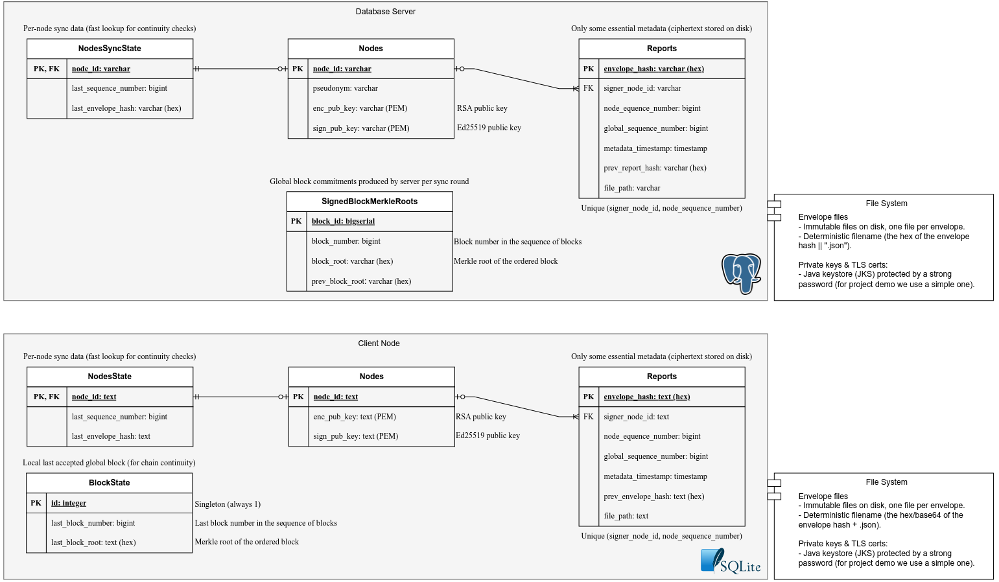

# CXX DeathNode / ChainOfProduct / CivicEcho Project Report

## **1. Introduction**

DeathNode is an anonymous reporting platform operated by a clandestine group called The Cult of Kika. Members submit encrypted reports about alleged crimes or suspects before information reaches authorities. We were assigned this scenario and selected **Challenge B** (vigilant server monitoring) as our security focus.

**Architectural clarification**: While the scenario describes a "peer-backed system", after discussion with teacher **Vaibhav Arora**, we were clarified that clients do not communicate directly with each other. Instead, every communication in the network occurs centrally through a coordination server. The peer-backed characteristic manifests only in that each client maintains a local copy of all network reports, periodically synchronizing with the server for consistency.

**Anonymity interpretation**: The requirement for "full username anonymity" is satisfied by design, as the system requires no user authentication or identity verification. Participants choose pseudonyms freely, which are not linked to real identities and can be changed at will. Therefore, linking reports to specific individuals is architecturally impossible without external information.

## **2. Goals**

Given the scenario requirements and our architectural interpretation, this project aims to protect:

**Core security objectives** (from scenario requirements):

- **Confidentiality (SR1)**: Only authorized network participants can decrypt reports. Protects sensitive information from disclosure to external attackers or unauthorized nodes.

- **Individual Integrity (SR2)**: Reports cannot be altered after submission. Protects against tampering during transmission, storage or by compromised system components (data corruption, malicious injection).

- **Batch Integrity (SR3)**: Missing, duplicated or out-of-order reports are detectable during synchronization. Ensures complete and correct history reconstruction at all nodes.

- **Consistency (SR4)**: Forged or diverging histories are detectable. Prevents malicious servers or nodes from presenting conflicting views of network state.

**Challenge B objective**:

- **Availability**: The system remains operational despite flooding attacks. A vigilant monitor detects misbehaving members and can ban them (temporarily or permanently), preventing spam from disrupting legitimate operations.

These objectives collectively ensure that the reporting platform remains trustworthy, resilient and operational even under adversarial conditions, while preserving the pseudonymous nature of participant interactions.

## **3. Assumptions**

> ### Disclaimer
> We thought of DeathNode as a service where members of the cult can share small collections of reports instead of (solely) single posts, assuming it to lean more towards a distributed report repository rather than a thread-like social platform. This way we improve the general purpose and interest of the solution to compensate for the low number of member nodes.

The DeathNode network follows a centralized synchronization model in which all nodes exchange reports through a central server. This server is responsible solely for coordinating synchronization and ordering and is **not trusted** with access to report contents. All reports are encrypted end-to-end and remain confidential to authorized client nodes at all times.

The anonymity network is assumed to be fixed and static. The full set of participating nodes is known at deployment time, and no dynamic membership, joins or revocations are supported. For demonstration purposes, the system consists of two client nodes, one central synchronization server and one database server. All nodes are pre-configured with the necessary cryptographic material, and certificates are issued by a certification authority during setup. Only nodes belonging to this predefined set are authorized to participate in the network and access reports.

Reports are immutable: once published, they cannot be modified or deleted. Anonymity relies exclusively on the use of pseudonyms and is therefore treated as an application-level concern rather than a cryptographic guarantee.

We assume no benign failures or crashes. Any detected inconsistency is treated as a potential attack and results in immediate rejection of the affected data. Under this assumption, availability is intentionally sacrificed in favor of strong integrity and consistency guarantees.

The challenge description refers to a “vigilant server, appointed by the leadership”. In our implementation, this role is realized by a fixed monitor server deployed alongside the central synchronization server, rather than by dynamically appointed leadership.

The system design explicitly separates three security goals: confidentiality of report contents, integrity of individual reports, and global consistency of histories across nodes. Confidentiality is achieved solely through encryption, while integrity and ordering are enforced through per-sender chaining and signed cryptographic commitments. The implementation is intentionally lightweight and limited to mechanisms strictly required to meet the project’s security objectives, not to overengineer, as also recommended by the TA's.

### **Threat Model**

In this project, we consider the following trust levels.

#### **Fully Trusted**

- The Certification Authority (CA) that issues and manages cryptographic keys and certificates for network nodes.

#### **Partially Trusted**

- **Each Client Node:**
  Client nodes are trusted to decrypt and read reports they are authorized to access, but not with preserving global integrity. A compromised client may attempt to:

  - tamper with locally stored encrypted envelopes or metadata,
  - inject forged or replayed reports,
  - withhold valid reports or selectively refuse to synchronize.

  The attacker is assumed unable to break cryptographic primitives or forge valid signatures without access to private keys. Integrity verification, per-node chaining, and global consistency checks mitigate these attacks.

- **The Monitor Server:**
  The monitor server is trusted only to observe synchronization behavior and detect flooding or protocol misuse. It is not trusted with report contents. A compromised monitor may attempt to drop messages, alter metadata, or misreport synchronization state, but cannot forge valid cryptographic commitments verified by clients.

#### **Untrusted**

- **The Network:**
  The communication network is fully untrusted. An attacker may eavesdrop, delay, replay, modify, or inject messages between nodes. All protocol messages are therefore assumed to require confidentiality, integrity and authenticity protection.

- **The Central Server:**
  The central server is assumed to be potentially malicious. An attacker controlling it may attempt to:

  - reorder, omit, duplicate, or selectively deliver reports,
  - tamper with stored metadata or synchronization state,
  - perform rollback or equivocation attacks across clients.

  The server is assumed incapable of decrypting reports or forging signatures, and all such misbehavior must be detectable by honest clients.

- **The Database Server:**
  The database server is untrusted and may be compromised independently. An attacker may attempt to read, modify, delete or roll back metadata entries. Since it stores no plaintext reports and all critical data is integrity-protected, such attacks need to be detectable during verification.

## **4. Solution Brief**

**!!!!!!!!!!!!!!!!!!   TODO   !!!!!!!!!!!!!!!!!! (_Brief solution description_)**
(IS THIS NECESSARY?)
 
## **5. Project Development**

In this section, we describe the design and implementation of our solution to protect the DeathNode network reports.

### **5.1 Secure Document Format (Security Library)**

This section describes the design rationale and implementation details of the secure document library we developed to protect DeathNode reports. The library exposes three operations (`protect`, `check`, `unprotect`) and implements confidentiality, integrity, authenticity and lightweight consistency guarantees required bythe four security requirements.

#### **5.1.1 Solution Design**

##### **Goals**

- **Confidentiality (SR1):** Only authorized nodes can read report contents. Achieved by encrypting the inner payload with a fresh symmetric Data Encryption Key (DEK) per-report and wrapping that DEK with each recipient's public key.
- **Integrity & Authenticity (SR2):** Report contents must be tamper-evident and attributable to a signer. Achieved with an Ed25519 digital signature over the canonicalized `(report || metadata)` pair.
- **Ordering / Missing / Duplicates / Fork detection (SR3, SR4):*- Each sender (or client/node) maintains a per-sender monotonic `node_sequence_number` and `prev_envelope_hash` forming a lightweight per-sender hash chain, where peers validate sequence/prev-hash to detect missing, duplicate or out-of-order messages and to detect equivocation. This is used along with Merkle Roots computation to ensure global consistency during synchronization (described in section [5.2](#52-security-protocol-description-synchronization-integrity-and-consistency)).
- **Performance and security of tools:** Use of well-supported, s- ndard algorithms available in Java’s crypto stack (AES-GCM, RSA-OAEP, Ed25519) to avoid implementing low-level crypto, as required.

##### **High-level message structure (envelope)**

An envelope contains three top-level sections:

1. `metadata` - descriptive fields and report history state (report_id, timestamps, node_sequence_number, prev_envelope_hash, signer id/alg).
2. `key_encrypted` - DEK wrapped for each recipient (`RSA-OAEP-SHA256`), where metadata describes the wrapping algorithm.
3. `report_encrypted` - AEAD (Authenticated Encryption with Associated Data) encrypted content performed with AES-256-GCM. Here, the metadata is bound as AAD (Associated Authenticated Data) to the AEAD operation. More details on this next.

```json  
{
  "metadata": {
    "report_id": "abc123",
    "metadata_timestamp": "2025-10-28T12:00:00Z",
    "report_creation_timestamp": "2025-10-28T10:00:00Z",
    "node_sequence_number": 42,
    "prev_envelope_hash": "hex(SHA256(previous_envelope))",
    "signer": { "node_id": "nodeA", "alg": "Ed25519" }
  },

  "key_encrypted": {
    "encryption_algorithm": "RSA-OAEP-SHA256",
    "key_per_node": [
        {"node": "self", "encrypted_key": "b64url(...)"},
        {"node": "nodeB", "encrypted_key": "b64url(...)"},
        {"node": "nodeC", "encrypted_key": "b64url(...)"},
    ]
  },

  "report_encrypted": {
    "encryption_algorithm": "AES-256-GCM",
    "nonce": "b64url(encNonce)",
    "ciphertext": "b64url(...)",
    "tag": "b64url(...)"
  }
}
```

*Inner plaintext (encrypted with DEK)* contains:

* the `report` JSON object,
* the `signature` (Ed25519 over `canonical(report) || canonical(metadata)`).

```json
{
  "report": {
    "report_id": "abc123",
    "report_creation_timestamp": "2025-10-28T12:00:00Z",
    "reporter_pseudonym": "shadow_fox",
    "content": {
      "suspect": "john_doe",
      "description": "Alleged involvement in organized crime",
      "location": "Tokyo, Japan"
    },
    "version": 1,
    "status": "pending_validation"
  },
  "signature": "b64url(Ed25519(SignPayload))"
}
```

##### **Canonicalization and signing**

Signatures and hash chains require a deterministic byte representation. We canonicalize JSON before hashing/signing: keys are deterministically ordered and objects serialized to UTF-8. The signature input is the concatenation of canonical `report` bytes and canonical `metadata` bytes.

> Rationale: Without deterministic canonicalization two nodes serializing the same logical JSON may produce different bytes and signatures/hashes will fail to verify.

##### **Algorithms, parameters and choices**

- **Symmetric encryption (AEAD):** AES-256-GCM (12-byte nonce, 128-bit tag). Metadata is used as Associated Authenticated Data (AAD) to bind metadata to content integrity.
- **Key wrapping:** RSA-OAEP with SHA-256 and MGF1 (`"RSA/ECB/OAEPWithSHA-256AndMGF1Padding"`) to encrypt per-recipient DEKs.
- **Signatures:** Ed25519 for digital signatures (signing `(report || metadata)`). We don't use any pre-hashing as Ed25519 hashes internally.
- **Signature bytes included inside the encrypted payload:** This prevents an on-path adversary from reading or replacing signatures, solving signature-swap/impersonation attacks. Also allows the other nodes to authenticate the submitter without decrypting, so as to reject invalid submissions early, before any costly decryption or compromising.
- **Hashing:** SHA-256 used for `prev_envelope_hash` (hex encoded).
- **Encoding:** In our current implementation hash fields are encoded as hexadecimal strings via `HashUtils.bytesToHex(...)`, while the remaining (keys, signatures) are base64url encoded.
- **Key separation:** Each client node and the server have two key pairs: an RSA key pair for confidentiality (DEK wrapping) and an Ed25519 pair for signing. 

##### **Why these choices are effective**

- AEAD provides confidentiality and integrity in one primitive, and AES-GCM is widely available and efficient for this [[1]](#ref1)[[2]](#ref2). Binding metadata as AAD ensures metadata or ciphertext cannot be changed without detection. This is because GCM produces an authentication tag that covers both the ciphertext and the AAD, so any modification to either will result in decryption failure as the tag will not match.
- RSA-OAEP with SHA-256 is a efficient way to wrap symmetric keys for a set of recipients, as RSA is performant for small data like keys. [[3]](#ref3)
- The ideal GCM tag size is typically 128 bits (16 bytes) for strong security and broad compatibility [[2]](#ref2).
GCM runs CTR internally which requires a 16-byte counter. The IV provides 12 of those, the other 4 are an actual block-wise counter. If we supply a larger-than-12-bytes IV then it needs to be hashed allowing collisions to happen and raising the risk for IV reuse unneccessarily high.
- Ed25519 is used for signatures because it is fast, small, and standardized for signatures (not good, however, for encryption). This was chosen over ECDSA due to its stronger security guarantees and safer design [[4]](#ref4).
- Signing and encryption address different security properties. Using separate keys avoids cross-protocol attacks and follows standard cryptographic practice, ensuring that compromising one key does not compromise the other security properties, which increases overall system robustness.
- The per-sender sequence number plus the prev-hash is simple and efficient to detect missing, duplicate or forked sequences in a synced peer network where a full consensus protocol would be overkill.

#### **5.1.2 Implementation & Technologies**

##### **API summary**

- `protect(report, metadata, recipientPubKeys, signerPrivKey)` - outputs the Envelope  
  Produces an envelope with encrypted report payload and a set of wrapped DEKs for recipients.

- `check(envelope)` - outputs { valid: boolean, reasons: [String] }  
  Performs structural and semantic validation of the envelope. 

- `unprotect(envelope, recipientPrivKey, recipientNodeId, senderPubKey)` - outputs the Report  
  Unwraps DEK for `recipientNodeId`, decrypts AES-GCM payload (AAD = metadata) and verifies Ed25519 signature. Throws `SecurityException` on AEAD failure or signature failure.

##### **Implementation details**

- **Programming language:** Java 21
- **Cryptographic libraries:** Java Cryptography Architecture (JCA).
- **Canonical JSON:** The code calls `canonicalJson(...)` on `JsonObject`s and then uses the resulting bytes as the canonical representation for signatures and AEAD AAD. 
- **Signing:** `signDataHex(payload, signerPrivKey)` signs `(report || metadata)` using `Signature.getInstance("Ed25519")` and produces a hex string.
- **Inner payload & encryption:** The `report` and `signature` are serialized to JSON and encrypted as the AEAD plaintext using AES-256-GCM. The metadata bytes are supplied to `Cipher.updateAAD(...)` before `doFinal(...)`.
- **DEK generation & wrapping:** A fresh AES key is generated for each envelope (`KeyGenerator.getInstance("AES"); kgen.init(256)`) and then wrapped individually for every recipient using RSA-OAEP (`Cipher.getInstance("RSA/ECB/OAEPWithSHA-256AndMGF1Padding")`).
- **Encoding:** The implementation uses hex encoding (via `HashUtils.bytesToHex`) for nonce, ciphertext, tag and wrapped keys as stored in `Envelope`. The envelope JSON contains `metadata`, `key_encrypted`, and `report_encrypted` sections.
- **check() behavior:** `check()` verifies presence and basic format rules for:

  - `metadata` fields (presence, timestamp parsing, if `signerAlg` is `Ed25519`, non-negative sequence number),
  - `key_encrypted` (algorithm string equals `"RSA-OAEP-SHA256"`, non-empty recipient key list, each entry has `node` and `encrypted_key`),
  - `report_encrypted` (algorithm `"AES-256-GCM"`, presence of `nonce`, `ciphertext`, `tag`).  
    `check()` intentionally does not perform cryptographic verification (unwrapping DEK or signature verification) because those require secret keys.    
    It is a fast structural validation intended to detect malformed or obviously invalid envelopes before attempting expensive crypto ops.


### **5.2 Security Protocol: Synchronization, Integrity and Consistency**

This section describes the synchronization protocol: how nodes submit reports, how the system synchronizes them, and how it detects missing, duplicated or out-of-order reports (SR3) and forged or diverging histories (SR4). The text explains the data that travels between parties, the commitments that nodes make, the checks performed by the server and by clients, and the response to any inconsistency. 


#### **5.2.1 Solution Design**

##### **Report submission -  local persistence and per-sender ordering**

Each report is produced by a node and information of that report is immediately stored on disk (filesystem) at that node in **encrypted form**. The file is the canonical encrypted artifact for that report and contains only ciphertext and the minimal metadata required to locate and verify it later.

In addition to the encrypted file, each node maintains an append-only sequence for the reports it publishes: every new report includes a cryptographic link to (or the hash of) the previous report published by the same node. This per-sender link provides an immutable local ordering for that publisher.

When the file is created, the node also updates the database with relevant metadata (e.g., the file path), and appends the new report to an in-memory buffer (a list of file paths). This buffer accumulates all **unsynced** reports until synchronization is triggered.


##### **Clear outer metadata and AEAD binding**

Each report contains an outer clear header that contains only **non-sensitive routing and ordering fields** (for example: a timestamp for coarse global sorting, the per-sender sequence number and the per-sender link to the previous report).

This outer metadata is kept in cleartext so the server can perform global ordering without accessing report contents. However, and as referenced in [5.1.1](#511-solution-design), the metadata is **bound to the encrypted payload** using authenticated encryption with associated data (AEAD, via AES-GCM). So, any modification to the metadata will cause decryption to fail at receiving nodes.

End-to-end authorship and integrity are guaranteed by a digital signature placed **inside** the encrypted payload (see [5.1.1](#511-solution-design)). 

##### **Merkle commitments for buffers**

When a synchronization round is initiated, each node computes a **Merkle tree** over the buffered encrypted files and derives a Merkle root. The node signs this Merkle root with its signing key and persists the signed root.

The signed root is the node’s compact, tamper-evident **commitment** to the exact set and ordering of the buffered items at that moment. This lets the node prove later which exact envelopes it intended to publish in that sync round.

##### **Synchronization procedure (message flow)**

1. Synchronization is initiated either periodically or on demand.  
2. When a node needs to sync with the server, it sends a **`Hello`** (with *`sync flag`* set) request.  
3. The server acknowledges the creation of a new sync round and requests all the contents present in all clients’ buffers (**`RequestBuffer`**).  
4. Each client then sends to the server a **`BufferUpload`** message containing:  
   - Up to **N** buffered envelopes (N is configurable),  
   - The **Merkle root** of the buffer,  
   - The node's **signature** on that Merkle root.  
5. The server receives the buffers from all nodes and **verifies each node's buffer**:
   - Verify the node's signature on the Merkle root.
   - Recompute the Merkle root from the received envelopes and ensure it matches the signed root -  this guarantees the set of files the server received is exactly the set the node committed to (prevents in-transit tampering or lost contents).
   - Verify per-sender **hash chain continuity**: ensure the first report sent by each node links correctly to the last known synced report from that node, and that all subsequent reports link correctly to their predecessors (this detects missing, duplicated or out-of-order reports per sender).  
   **Note:** The hash chain *per se* does not detect if the last envelope (in each nodes' buffer or in the `SyncResult` from the server) is missing, as this would require knowledge of future envelopes. This is detected instead by the Merkle root commitment, which binds the entire set of envelopes. So they work together to provide full integrity guarantees.
6. If all buffers are valid, the server sorts all received envelopes **globally** by their metadata timestamp, producing a single, totally ordered list of all reports from all nodes.
7. The server constructs a new **block** that commits to this global ordering:
   - Compute the Merkle root of the ordered envelopes,
   - Link to the previous block’s root,
   - Sign the new block root,
   - Increment the block number.
8. The server then broadcasts a **`SyncResult`** message to all clients containing:
   - The globally ordered list of envelopes,
   - The new block root, signed block root, block number, and previous block root,
   - The signed Merkle roots that it received from each node (for cross-verification).
9. Each client receives the `SyncResult` and performs a **multi-stage verification pipeline** (described next, in [Client verification: multi-stage pipeline](#client-verification-multi-stage-pipeline-on-receiving-syncresult)).

> Note: each step above corresponds to concrete protocol messages (`Hello`, `RequestBuffer`, `BufferUpload`, `SyncResult`, which will be referenced in [5.2.2](#522-implementation--technologies)) and concrete checks the server executes on received data.

##### **Client verification: multi-stage pipeline (on receiving `SyncResult`)**

Upon receiving a `SyncResult`, each client performs a **multi-stage verification pipeline**. Only after all six stages pass does the client accept the sync result. Any failure triggers immediate rejection and an error report to the server, followed by cleanup of unsynced data.

**Stage 1: Server Block Signature**
- Verify `signed_block_root` using the server's Ed25519 public key.  
- **Protects against:** Server impersonation, forged sync results.

**Stage 2: Block Chain Continuity**
- Compare the `block number` and `previous block root` with locally stored last block.  
- Ensure `block number = last block number + 1`.  
- Ensure `previous block root` matches last known `block root`.  
- **Protects against:** Server equivocation, forked histories (SR4).

**Stage 3: Block Merkle Root**
- Recompute Merkle root from received ordered envelopes.  
- Verify it matches `block root`.  
- **Protects against:** Server reordering, omitting, or modifying envelopes (SR3, SR4).

**Stage 4: Per-Node Buffer Signatures**
- For each node that participated in the round:
  - Verify the signature on the node's `signed buffer root` using that node's public key.  
- **Protects against:** Server fabricating buffers on behalf of nodes (SR4).

**Stage 5: Per-Sender Hash Chains**
- For each sender (nodeA, nodeB, etc.), extract their envelopes from the ordered list and verify:
  - The first envelope's `previous envelope hash` matches the last known synced envelope hash for that sender,
  - Each subsequent envelope links correctly to its predecessor,
  - Sequence numbers increment by 1.  
- **Protects against:** Missing, duplicated or reordered reports per sender (SR2, SR3).

**Stage 6: Individual Envelope Processing**
- For each envelope:
  - Store to disk with deterministic filename (hash-based),
  - Decrypt and verify signature,
  - Update local database.
- **Protects against:** Corrupted files, forged reports (SR1, SR2).

Only if all verification stages pass does the client accept the sync result, store the new envelopes, and update its local state. Any failure triggers immediate rejection, error reporting to the server.


##### **Merkle Tree Commitments (SR3)**

Why this is used (SR3):
- **Batch integrity:** The Merkle root is a compact (32-byte) cryptographic commitment to the **exact set and order** of envelopes in the buffer.
- **Tamper detection:** If an attacker modifies, adds, or removes even one envelope in transit, the recomputed Merkle root will differ from the signed root.
- **Non-repudiation:** Because the sender signed the root before transmission, they cannot later deny having sent that specific set of envelopes.

This technique efficiently detects **missing or tampered reports at the batch level** before individual processing begins.

This creates a **server-maintained blockchain** where each block:
- Commits to a specific global ordering of reports,
- References the previous block cryptographically,
- Is signed by the server.

How this satisfies SR4 (Consistency):
- **Fork detection:** If the server attempts to produce two different orderings for the same sync round (equivocation), clients will detect mismatching block roots.
- **History continuity:** The `previous block root` chain ensures that past synchronization rounds cannot be retroactively altered without breaking the chain.
- **Cross-node verification:** Clients verify that other nodes' signed Merkle roots match what the server claims to have received, detecting server-side tampering with buffer contents.


##### **Data-at-Rest Integrity Verification (SR2, SR4)**

If a client’s local storage is compromised (for example, encrypted report files are altered directly on disk), the system must be able to detect such tampering.   

Because continuously re-verifying all stored reports would be computationally expensive, these checks are performed **on-demand**, whenever a report is accessed or audited. Each client can verify that locally stored data at rest has not been modified. The `list-reports` command performs integrity checks before decrypting and listing reports. Any tampering is detected by the `unprotect()` tool: AES-GCM authentication will fail if ciphertext or AAD were changed, while the Ed25519 signature verification will fail if plaintext was altered. And this error is immediately reported to the user.

This provides defense against:
  - Filesystem corruption,
  - Malicious local process modifications,
  - Storage media bit-flips.


##### **Security Properties Summary**

| Requirement | Mechanism | Enforcement Point |
|------------|-----------|------------------|
| **SR1: Confidentiality** | End-to-end AES-GCM encryption | Only authorized nodes can decrypt |
| **SR2: Integrity (individual)** | End-to-end AES-GCM and Ed25519 signatures inside ciphertext | Client verification upon decryption |
| **SR3: Integrity (batch)** | Per-sender hash chains + Merkle trees | Server and client verification |
| **SR4: Consistency** | Signed block roots + block chaining | Client multi-stage verification pipeline |


#### **5.2.2 Implementation & Technologies**

##### **Protocol Definition**

The synchronization protocol is defined using **Protocol Buffers 3** (`.proto` files).

Key message types:
- `Hello`: Connection establishment and sync initiation
- `BufferUpload`: Client submits envelopes + signed Merkle root
- `RequestBuffer`: Server requests buffers from all clients
- `SyncResult`: Server distributes globally ordered envelopes + block commitment
- `SignedBufferRoot`: Per-node buffer commitment metadata
- `Error`: Error reporting between parties

Communication uses **gRPC bidirectional streaming** over HTTP/2.

##### **Client Implementation**

Main technology stack:
- Java 21
- SQLite 3 - Lightweight, file-based relational database
- gRPC-Java - High-performance, open-source RPC framework that allows clients and servers to communicate transparently
- Gson - JSON parsing for envelope processing

##### **Server Implementation**

Main technology stack:
- Java 21
- Spring Boot 3 - Application framework with dependency injection, transaction management
- PostgreSQL 18 - Relational database for persistent storage
- JPA/Hibernate - ORM for database access
- gRPC Spring Boot Starter - Integrates gRPC server with Spring lifecycle
- Gson

##### **Cryptographic Operations**

Merkle tree implementation:
- Binary tree construction using SHA-256
- Leaf nodes: `H(envelope_bytes)`
- Internal nodes: `H(left_child || right_child)`
- Padding: If odd number of leaves, duplicate last leaf
- Root: 32-byte hash commitment

Hash operations:
- Algorithm: SHA-256
- Output: 32 bytes (256 bits)
- Used for: Envelope hashes, Merkle tree nodes, block roots, hash chains
- Library: `java.security.MessageDigest`


### **5.3 Security Challenge**

If a node were to be compromised due to an attack, one possible threat could be the mass creation of reports to stress the system. Bearing this, we found challenge B the most fit for a more robust final solution, playing an important role in security for the system.

#### **5.3.1 Solution Design**

This security challenge required us to introduce a new entity in the system: the monitor server. This server is responsible for observing network activity and detecting flooding attacks from misbehaving nodes. As it is possible to observe in the network architecture diagram in [5.5.1](#551-network-and-machine-setup), we leveraged the fact that we needed a gateway from each client network to the central server, and vice versa, to place the monitor server in between them. This way, all client-server communications pass through the monitor, allowing it to effectively monitor traffic and identify potential flooding attacks.

We also leveraged the fact that each client keeps an in-memory structure (buffer, or more simple, a list with the unsynced reports), and that it uses it to decide when to send Sync requests to the server (fixed-size messages), when the buffer reaches a certain size. This means that a misbehaving client that wants to flood the network with fake reports would have to send a lot of Sync requests to the server in a short period of time, as each Sync request can only carry a limited number of reports.

If a client sends a second synchronization request within a 30-second window, it is blocked for 30 seconds. With every block, the timeout doubles.

The client handles timeouts by simply clearing their buffer, considering itself to be abusive or possibly compromised.

#### **5.3.2 Implementation & Technologies**

This monitor server was implemented using the **Scapy** library in **Python**. It sniffs two interfaces `eth1` and `eth2` — one for each client — and keeps track of metrics (bytes, number of packets, sync requests) in a 30-second window.

As it's static, the packet size is used to detect Sync requests. With this detection, it keeps count of how many Sync requests each client sends in a time window. When flooding is detected, the monitor server flags the client as misbehaving and blocks its further communications to the central server. This is enforced by adding a new `iptables` rule to drop incoming packets from such client, thus not forwarding them to the central server. This block is not permanent, as after a timeout period, the monitor server will delete the previously created firewall rule and allow the client to communicate with the central server again.

The implementation avoids dependencies with the rest of the system, making it highly dynamic. It can be started and stopped at any time, without interrupting the system.

### **5.4 Storage**



The picture above illustrates the database schema used in our implementation, in both client nodes and database server. The database is used to store metadata about reports, nodes, and synchronization state, while we use the filesystem to store the actual envelope files containing the encrypted reports.

Private keys are stored using **Java KeyStore (JKS)** on each node. JKS provides encrypted at-rest storage for cryptographic keys and integrates natively with Java’s security APIs. Both the keystore and individual key entries are password-protected. For simplicity in this project, the same password (`"demonstration"`) is used for both, although distinct passwords would be recommended in a production deployment.

### **5.5 Infrastructure**

#### **5.5.1 Network and Machine Setup**

**!!!!!!!!!!!!!!!!!!   TODO   !!!!!!!!!!!!!!!!!!**


6.2. Firewall rules
6.3. Justification of the chosen infrastructure

(_Provide a brief description of the built infrastructure._)

(_Justify the choice of technologies for each server._)

#### **5.5.2 Communication Security**

All network communications in the DeathNode system are protected using **Transport Layer Security (TLS 1.3)** with **mutual authentication (mTLS)**, ensuring that both parties in every connection verify each other's identity before exchanging data. This provides confidentiality, integrity and authenticity at the transport layer, complementing the end-to-end security guarantees of the secure document format.

##### **Two-Level Key Architecture**

The security architecture distinguishes between two independent key layers:

1. **User-level cryptographic keys** (detailed in Section [5.1.1](#511-solution-design)):
   - RSA-2048 key pairs for report encryption (wrapping content encryption keys)
   - Ed25519 key pairs for digital signatures (signing reports and commitments)

2. **Transport-level TLS keys** (this section):
   - RSA-2048 key pairs for TLS server/client authentication
   - X.509 certificates signed by a Certificate Authority

This separation follows the cryptographic principle of **key separation**: using distinct keys for different purposes prevents cross-protocol attacks and limits the impact of key compromise. A compromised TLS key does not grant access to encrypted report contents, and vice versa.

##### **Public Key Infrastructure (PKI)**

The system employs a **Certificate Authority (CA)** to manage trust relationships:

- **CA certificate** (`ca-cert.pem`): Self-signed root certificate distributed to all entities at deployment time
- **CA private key** (`ca-key.pem`): Kept secure and never distributed, used only to sign entity certificates
- **Entity certificates**: Each node, server and database receives a unique certificate signed by the CA

All certificates include **Subject Alternative Names (SANs)** with both DNS names and IP addresses to support flexible deployment scenarios (localhost, Docker containers, VMs).

##### **Communication Channel 1: gRPC (Client ↔ Server)**

The bidirectional gRPC streaming connection between clients and the central server is secured using **mutual TLS**:

**Server configuration** (`application.yml`):
```yaml
grpc:
  server:
    security:
      enabled: true
      certificate-chain: tls-cert.pem    # Server identity
      private-key: tls-key.pem           # Server private key (PKCS#1 PEM)
      trust-cert-collection: ca-cert.pem # Trusted CA for client certs
      client-auth: REQUIRE                # Enforce mutual TLS
```

The server presents its certificate to clients and **requires** clients to present valid certificates signed by the trusted CA.

**Client configuration** (`GrpcConnectionManager.java`):
```java
SslContext sslContext = GrpcSslContexts.forClient()
    .trustManager(ca-cert.pem)              // Trust server cert
    .keyManager(tls-cert.pem, tls-key.pem)  // Client identity
    .build();
```

Clients verify the server's certificate and present their own for authentication. The gRPC-Netty library handles TLS negotiation and certificate validation automatically.

**Key format**: gRPC-Netty accepts **PKCS#1 PEM** format for private keys, which is the standard OpenSSL output format.

##### **Communication Channel 2: JDBC (Server ↔ Database)**

The connection between the Spring Boot server and the PostgreSQL database is also secured with mutual TLS, but this required a **separate client certificate** for the server when acting as a database client.

> Why a separate certificate?

Unlike the gRPC scenario where the server acts as a **TLS server**, when connecting to PostgreSQL, the Spring Boot application acts as a **TLS client**. PostgreSQL's authentication model requires:
- The client certificate's **Common Name (CN)** must match the database username (`dn_admin`)
- The certificate represents the **client's identity**, not the server's

Reusing the gRPC server certificate would violate this requirement (its CN is `deathnode-server`, not `dn_admin`) and mix two distinct trust domains.

PostgreSQL server configuration (`pg_hba.conf`):
```
hostssl deathnode dn_admin 0.0.0.0/0 cert clientcert=verify-full
```

This enforces that:
- Only SSL connections are allowed
- The client must present a valid certificate
- The certificate must be signed by the trusted CA
- The CN must match the connecting user

Spring Boot JDBC configuration (`application.yml`):
```yaml
spring:
  datasource:
    url: jdbc:postgresql://...?ssl=true&sslmode=verify-full
         &sslrootcert=db-client/ca-cert.pem
         &sslcert=db-client/client-cert.pem
         &sslkey=db-client/client-key.pk8
```

**Critical requirement**: The PostgreSQL JDBC driver requires private keys in **PKCS#8 DER format** (`.pk8` files), not the standard PEM format. This is a driver-specific requirement not present in other PostgreSQL clients.

##### **Key Generation and Distribution Process**

All cryptographic material is generated using an automated script (`generate-all-keys.sh`) that:

1. **Generates the CA** (one-time operation):
   - Creates a 4096-bit RSA root key pair
   - Generates a self-signed X.509 certificate valid for one year
   - Sets restrictive permissions (private key: 600, certificate: 644)

2. **For each client node**:
   - Generates Ed25519 key pair (user-level signing) in PEM and DER formats
   - Generates RSA-2048 key pair (user-level encryption) in PEM and DER formats
   - Generates RSA-2048 key pair (transport-level TLS)
   - Creates Certificate Signing Request (CSR) with node-specific CN
   - Signs CSR with CA to produce TLS certificate with appropriate SANs
   - Converts keys to PKCS#12 format and imports into Java Keystore (JKS) for user-level keys
   - Copies CA certificate to trust store

3. **For the server**:
   - Generates user-level key pairs (Ed25519 + RSA-2048)
   - Generates gRPC server TLS certificate with CN=`deathnode-server` and SANs for all deployment scenarios
   - Additionally generates a separate PostgreSQL client certificate with CN=`dn_admin`
   - Converts the PostgreSQL client private key to **PKCS#8 DER format** (`.pk8`) for JDBC compatibility
   - Creates Java Keystore for user-level keys

4. **For the database**:
   - Generates RSA-2048 key pair for TLS server authentication
   - Creates certificate with CN=`deathnode-database`
   - Configures permissions (PostgreSQL requires key file to be owned by UID 999 with mode 600)

Key distribution:
- **CA certificate** - Distributed to all entities (public, can be freely shared)
- **CA private key** - Never distributed, it is supposed to be kept secure on the deployment machine
- **Entity private keys** - Stored locally on each node, never transmitted (Java Keystore files)
- **Entity certificates** - Public, stored alongside private keys but can be shared
- **Public keys** (user-level) - Stored in database tables (`nodes.sign_pub_key`, `nodes.enc_pub_key`) and distributed manually at deployment time

At deployment time:
1. Run `generate-all-keys.sh ca` to create the root CA
2. Run `generate-all-keys.sh client nodeA` for each client
3. Run `generate-all-keys.sh server` for the central server
4. Run `generate-all-keys.sh database` for PostgreSQL
5. Distribute CA certificate to all entities
6. Manually insert user-level public keys into database tables (one-time setup)

##### **Challenges Encountered**

Several technical challenges arose during implementation:

1. **Key format incompatibility**: PostgreSQL JDBC requires PKCS#8 DER format while gRPC accepts PKCS#1 PEM. Solution: generate both formats during key creation.

2. **Certificate role separation**: Initially attempted to reuse server certificates for client authentication, which violated PKI principles.  
Solution: generate dedicated client certificates with appropriate CN values.

3. **Java Keystore creation**: Importing Ed25519 and RSA keys into JKS format required intermediate PKCS#12 conversion with temporary self-signed certificates.  
Solution: automated the conversion pipeline in the key generation script.

4. **PostgreSQL file permissions**: Docker containers run PostgreSQL as UID 999, requiring special ownership and permission handling.  
Solution: use Docker volumes with explicit `chown` operations during container initialization.

5. **SAN configuration**: Certificates needed to support multiple deployment scenarios (localhost, Docker DNS, static IPs).  
Solution: include comprehensive SANs during certificate creation with `subjectAltName` extensions.

## **6. Conclusion**

The DeathNode project successfully implemented a secure, distributed reporting system that protects participant anonymity while maintaining strong integrity and consistency guarantees. Through the integration of end-to-end encryption, digital signatures, hash chains, Merkle tree commitments, and mutual TLS authentication, we created a defense-in-depth architecture that addresses all security requirements of the challenge scenario.

### Requirements Satisfaction

All four security requirements were **fully satisfied**, as detailed in the previous sections. The secure document format (Section 5.1) provides confidentiality and individual integrity through AES-GCM encryption and Ed25519 signatures. The synchronization protocol (Section 5.2) ensures batch integrity and consistency through hash chains, Merkle trees, and cryptographic block chaining. The security challenge (Section 5.3) was addressed with a vigilant monitor server providing intrusion detection and database integrity verification. The infrastructure requirement (Section 5.5) was met with complete VM deployment, network segmentation and mutual TLS for all communications.

### Future Enhancements

While the system is cryptographically sound, several improvements could enhance robustness:

1. **Enhanced error recovery**: Fix current recovery bugs and implement more sophisticated recovery mechanisms beyond timeout-based cleanup, such as partial state synchronization or incremental retry strategies.

2. **At rest tampering management**: Now that users can detect local storage tampering, implement ways of giving the user options on how to proceed (e.g., quarantine, re-sync from server, etc.).

3. **Stronger block chaining**: Instead of directly including the `previous block root` in the `SyncResult`, compute `hash(prev_block_root)` and include that. This would require only minor changes to client-side verification logic.

4. **Dynamic membership**: Extend the protocol to support nodes joining or leaving the network after deployment, requiring key distribution mechanisms and membership change consensus.

## **7. Bibliography**

[1]  **Dworkin, M.** *Recommendation for Block Cipher Modes of Operation: Galois/Counter Mode (GCM) and GMAC*. National Institute of Standards and Technology (NIST), 2007. [Link](https://nvlpubs.nist.gov/nistpubs/legacy/sp/nistspecialpublication800-38d.pdf)  
[2] **Apache Iceberg.** "AES GCM Stream Spec." *Apache Iceberg*, n.d. [Link](https://iceberg.apache.org/gcm-stream-spec/#file-structure)  
[3] **Poturalska, S.** "How RSA-OAEP Secures Symmetric Keys: Asymmetric Armor for Real Encryption Systems." *Medium*, 2025. [Link](https://medium.com/@santura/how-rsa-oaep-secures-symmetric-keys-asymmetric-armor-for-real-encryption-systems-44b6d26e17d8#:~:text=RSA%2DOAEP%20(Optimal%20Asymmetric%20Encryption%20Padding)%20is%20a,decryption%20error%20is%20indistinguishable%20from%20padding%20failure)  
[4] **Kontsevoy, E.** "Comparing SSH Keys - RSA, DSA, ECDSA, or EdDSA?" *Teleport*, 2022. [Link](https://goteleport.com/blog/comparing-ssh-keys/)  

----
END OF REPORT
